# SupabaseAuthApp - Architecture & Data Flow Documentation

## Overview

This application is a comprehensive AI-powered chat assistant built with React Native (Expo), featuring Supabase authentication, Google OAuth, MCP (Model Context Protocol) backend integration, deep linking capabilities, and multi-server MCP support.

## System Architecture


## Core Components

### 1. Frontend Architecture (React Native/Expo)

#### Key Components:
- **Landing Page (`app/(auth)/signin.tsx`)**: Animated welcome screen with Google OAuth
- **Chat Interface (`app/(tabs)/chat.tsx`)**: Main conversation interface with streaming
- **Deep Linking Service (`services/deepLinkingService.ts`)**: Natural language to app interaction
- **Session Management (`components/SessionList.tsx`)**: Chat session persistence
- **Theme System (`contexts/ThemeContext.tsx`)**: Embr fire theme with dark/light modes

#### Data Flow:
1. **Authentication**: Google OAuth → Supabase → Session storage
2. **Chat Interaction**: User input → Deep Link detection → AI processing → Response
3. **Session Management**: Messages → Supabase → Session list updates

### 2. Backend Architecture (Express.js)

#### Core Services:

##### MCP Server Manager (`src/services/mcpServerManager.ts`)
- **Purpose**: Central hub for managing internal and external MCP servers
- **Responsibilities**:
  - Register and manage internal MCP tools
  - Connect to and manage external MCP servers
  - Route tool execution requests
  - Provide unified tool discovery and metadata

##### External MCP Connector (`src/services/externalMcpConnector.ts`)
- **Purpose**: Manage connections to external MCP servers on different ports
- **Features**:
  - Health monitoring with 30-second intervals
  - Automatic reconnection handling
  - Tool discovery and metadata synchronization
  - Load balancing across multiple servers

##### AI Controller (`src/controllers/aiController.ts`)
- **Purpose**: Handle AI-powered conversations and tool orchestration
- **Decision Making Process**:
  1. Analyze user query for intent
  2. Determine if tools are needed
  3. Select appropriate tools based on context
  4. Execute tools and synthesize results
  5. Generate human-friendly response

## Data Flow Scenarios

### Scenario 1: Simple Chat Message


### Scenario 2: Deep Link Request

```mermaid
sequenceDiagram
    participant U as User
    participant C as Chat Interface
    participant D as Deep Link Service
    participant B as Backend API
    participant A as External App

    U->>C: "Open Spotify and play jazz"
    C->>D: Check if deep link query
    D->>D: Match keywords ["spotify", "play"]
    D->>D: Extract search term "jazz"
    D->>A: Open spotify://search:jazz
    A->>U: Spotify opens with jazz search
    C->>U: "✅ Opened Spotify"
```



### Scenario 3: MCP Tool Execution


### Scenario 4: External MCP Server Integration


## Decision-Making Processes

### 1. Chat Processing Pipeline

The system uses a **3-tier processing approach**:

#### Tier 1: Deep Link Detection
```typescript
// In ChatService.ts
const isDeepLinkQuery = DeepLinkingService.isDeepLinkQuery(userMessage);
if (isDeepLinkQuery) {
    const result = await DeepLinkingService.processDeepLinkQuery(userMessage);
    return result; // Skip AI processing
}
```

**Decision Criteria**:
- Contains keywords matching deep link patterns
- Intent is clearly app-specific (e.g., "open", "call", "navigate")
- No complex reasoning required

#### Tier 2: AI + Tool Orchestration
```typescript
// AI decides tool usage based on:
1. Query analysis: "What's my schedule?" → Calendar tools
2. Context awareness: Previous conversation history
3. Tool availability: Check registered tools
4. Parameter extraction: Date/time parsing
```

**Decision Matrix**:
| Query Type | Tools Considered | Fallback |
|------------|------------------|----------|
| Calendar queries | getTodaysEvents, createCalendarEvent | Generic response |
| Email queries | getEmails, getLastTenMails | "Cannot access emails" |
| Web research | crawlPage, searchWeb | "Cannot browse web" |
| App actions | Deep linking | "Cannot open apps" |

#### Tier 3: Fallback Response
- Pure conversational AI without tool usage
- General knowledge and reasoning
- Graceful degradation when tools unavailable

### 2. Tool Selection Algorithm

```typescript
class AIController {
    async selectTools(query: string): Promise<MCPTool[]> {
        // 1. Parse intent from query
        const intent = await this.parseIntent(query);
        
        // 2. Get available tools
        const tools = await this.mcpManager.getAllToolMetadata();
        
        // 3. Score tools based on relevance
        const scores = tools.map(tool => ({
            tool,
            score: this.calculateRelevanceScore(intent, tool)
        }));
        
        // 4. Select top-scoring tools
        return scores
            .filter(s => s.score > threshold)
            .sort((a, b) => b.score - a.score)
            .slice(0, maxTools)
            .map(s => s.tool);
    }
}
```

### 3. External Server Health Management

```typescript
class ExternalMCPConnector {
    // Health check every 30 seconds
    private startHealthChecking() {
        setInterval(async () => {
            for (const server of this.servers.values()) {
                const health = await this.checkHealth(server);
                this.updateServerStatus(server, health);
                
                if (health.status === 'disconnected') {
                    this.handleReconnection(server);
                }
            }
        }, 30000);
    }
}
```

## Configuration & Setup

### Environment Variables

**Frontend (.env)**:
```bash
EXPO_PUBLIC_SUPABASE_URL=your_supabase_url
EXPO_PUBLIC_SUPABASE_ANON_KEY=your_supabase_anon_key
EXPO_PUBLIC_GOOGLE_CLIENT_ID=your_google_client_id
EXPO_PUBLIC_MCP_BACKEND_URL=http://localhost:3001
```

**Backend (.env)**:
```bash
# Core Services
SUPABASE_URL=your_supabase_url
SUPABASE_SERVICE_ROLE_KEY=your_service_key
GOOGLE_CLIENT_ID=your_google_client_id
GOOGLE_CLIENT_SECRET=your_google_client_secret
GOOGLE_REDIRECT_URI=your_redirect_uri

# AI Service
GEMINI_API_KEY=your_gemini_key

# Server Config
PORT=3001
NODE_ENV=development
CORS_ORIGINS=http://localhost:3000,http://localhost:8081
```

### Adding External MCP Servers

```bash
# Add a new external MCP server
curl -X POST http://localhost:3001/api/external-mcp/servers \
  -H "Content-Type: application/json" \
  -d '{
    "name": "My Custom Server",
    "host": "localhost",
    "port": 8080,
    "protocol": "http",
    "description": "Custom tools server",
    "apiKey": "optional-api-key"
  }'

# Check server status
curl http://localhost:3001/api/external-mcp/servers/{serverId}

# Get comprehensive stats
curl http://localhost:3001/api/external-mcp/stats
```

## Security Considerations

### 1. Authentication Flow
- Google OAuth with PKCE
- Supabase session management
- JWT token validation on backend
- Automatic token refresh

### 2. External Server Security
- Optional API key authentication
- HTTPS enforcement for production
- URL validation and sanitization
- Timeout protection (5s health, 30s execution)

### 3. Deep Link Security
- URL scheme validation
- Parameter sanitization
- No sensitive data in URLs
- User confirmation for sensitive actions

## Performance Optimizations

### 1. Streaming Responses
- Server-Sent Events for real-time chat
- Chunked response processing
- Non-blocking tool execution

### 2. Caching Strategy
- Tool metadata caching
- Session state persistence
- Health check result caching (30s TTL)

### 3. Connection Pooling
- External MCP server connection reuse
- Google API client connection pooling
- Database connection optimization

## Monitoring & Debugging

### 1. Logging Strategy
```typescript
// Structured logging throughout the application
console.log(`🔧 Executing tool: ${toolName} for user: ${userId}`);
console.error(`❌ Error executing tool ${toolName}:`, error);
console.log(`🔌 Added external MCP server: ${serverName}`);
```

### 2. Health Endpoints
- `GET /api/health`: Backend health
- `GET /api/external-mcp/stats`: External server stats
- `GET /api/mcp/tools`: Available tools list

### 3. Error Handling
- Graceful degradation when services unavailable
- User-friendly error messages
- Automatic retry logic for transient failures

## Future Enhancements

### 1. Scalability
- Redis for session management
- Message queuing for tool execution
- Load balancer for external servers

### 2. Features
- Voice input/output
- File upload and processing
- Plugin system for custom tools
- Advanced analytics and insights

### 3. Security
- OAuth scopes refinement
- Rate limiting per user
- Audit logging for sensitive operations
- End-to-end encryption for messages

---

*This documentation provides a comprehensive overview of the system architecture, data flows, and decision-making processes. For specific implementation details, refer to the source code and inline comments.*