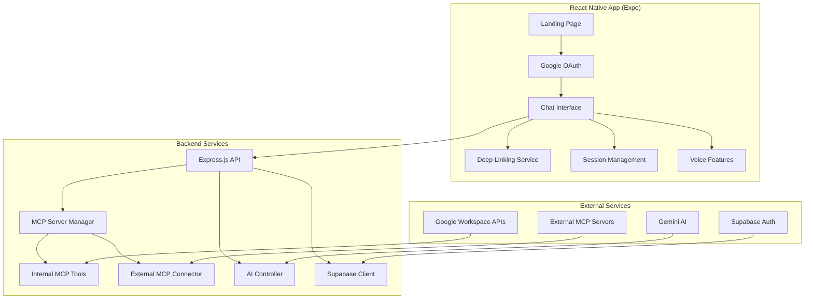

# 🔥 Embr - AI-Powered Voice Assistant

[](https://expo.dev/)
[](https://reactnative.dev/)
[](https://supabase.com/)
[](https://www.typescriptlang.org/)
[](https://nodejs.org/)

> **Embr** is a comprehensive AI-powered conversational assistant with voice capabilities, Google Workspace integration, deep linking, and extensible MCP (Model Context Protocol) architecture. Built with React Native (Expo) and powered by Gemini AI.

## ✨ Key Features

### 🎤 **Voice-First Experience**
- **Speech-to-Text**: On-device speech recognition with real-time transcription
- **Text-to-Speech**: Natural voice responses with streaming audio playback
- **Voice Mode**: Hands-free operation for seamless conversations
- **Smart Audio Controls**: Manual TTS control and interruption handling

### 🔗 **Smart Deep Linking**
- **Natural Language Processing**: "Open Spotify and play jazz" → `spotify://search:jazz`
- **Multi-App Support**: Spotify, Maps, Phone, Messages, Mail, and more
- **Context-Aware Actions**: Intelligent parameter extraction and app routing

### 🛠️ **MCP Architecture**
- **Extensible Tool System**: Modular tool architecture with MCP protocol
- **Google Workspace Integration**: Calendar, Gmail, Drive, Docs access
- **External Server Support**: Connect multiple MCP servers on different ports
- **Real-Time Health Monitoring**: Automatic server health checks and reconnection

### 🔐 **Enterprise-Ready Auth**
- **Google OAuth 2.0**: Secure authentication with PKCE flow
- **Supabase Backend**: Robust session management and data persistence
- **JWT Tokens**: Secure API authentication with automatic refresh

### 🎨 **Premium UI/UX**
- **Embr Fire Theme**: Beautiful gradient animations and smooth transitions
- **Dark/Light Mode**: Adaptive theming with system preference detection
- **Session Management**: Persistent chat history with organized conversation threads
- **Responsive Design**: Optimized for iOS, Android, and web platforms

## 🏗️ Architecture Overview



## 🚀 Quick Start

### Prerequisites

- **Node.js** 18.x or later
- **Expo CLI** (`npm install -g @expo/cli`)
- **iOS Simulator** or **Android Emulator** (or physical device)
- **Google Cloud Project** with OAuth 2.0 credentials
- **Supabase Project** with authentication enabled
- **Gemini AI API Key**

### 1. Clone and Install

```bash
git clone https://github.com/danielliaow/cf_ai_danielliao.git
cd cf_ai_danielliao
npm install

# Install backend dependencies
cd mcp-backend
npm install
cd ..
```

### 2. Environment Configuration

#### Frontend Environment (`.env`)
```bash
EXPO_PUBLIC_SUPABASE_URL=https://your-project.supabase.co
EXPO_PUBLIC_SUPABASE_ANON_KEY=your_supabase_anon_key
EXPO_PUBLIC_GOOGLE_CLIENT_ID=your_google_client_id
EXPO_PUBLIC_MCP_BACKEND_URL=http://localhost:3001
```

#### Backend Environment (`mcp-backend/.env`)
```bash
# Core Services
SUPABASE_URL=https://your-project.supabase.co
SUPABASE_SERVICE_ROLE_KEY=your_service_role_key
GOOGLE_CLIENT_ID=your_google_client_id
GOOGLE_CLIENT_SECRET=your_google_client_secret
GOOGLE_REDIRECT_URI=http://localhost:3001/auth/google/callback

# AI Service
GEMINI_API_KEY=your_gemini_api_key

# Server Configuration
PORT=3001
NODE_ENV=development
CORS_ORIGINS=http://localhost:3000,http://localhost:8081
```

### 3. Service Setup

#### Google Cloud Console Setup
1. Create a new project at [Google Cloud Console](https://console.cloud.google.com/)
2. Enable required APIs:
   - Google Calendar API
   - Gmail API  
   - Google Drive API
   - Google Docs API
3. Create OAuth 2.0 credentials:
   - **Application type**: Web application
   - **Authorized redirect URIs**: 
     - `https://your-supabase-project.supabase.co/auth/v1/callback`
     - `http://localhost:3001/auth/google/callback`

#### Supabase Setup
1. Create a new project at [supabase.com](https://supabase.com)
2. Go to **Authentication > Providers**
3. Enable Google OAuth provider with your credentials
4. Set up redirect URLs in your OAuth app

### 4. Run the Application

#### Start Backend Server
```bash
cd mcp-backend
npm run dev  # Development with hot reload
# or
npm run build && npm start  # Production build
```

#### Start React Native App
```bash
# In the main project directory
npm start        # Start Expo development server
npm run ios      # Run on iOS simulator
npm run android  # Run on Android emulator
npm run web      # Run in web browser
```

### 5. Try Out Components (Local)

Once the frontend and backend are running, you can explore key experiences:

- Chat and Voice: open the Chat tab in the app UI (Expo Router path: `/chat`).
- Onboarding: open the root/home tab (path: `/`).
- Settings: open the Settings tab (path: `/settings`).
- Auth screens: available under `(auth)` group (paths: `/signin`, `/callback`).

Notes:
- On web, use the browser URL bar to navigate to paths like `/chat` after `npm run web` launches.
- On native (iOS/Android), use the bottom tab bar to switch between Home, Chat, Profile, and Settings.

Optional deployed link: if you deploy the backend and a web build, add your public URL here for quick access.

## 💬 Usage Examples

### Voice Interaction
1. **Tap the 🎤 microphone** to start voice input
2. **Say**: "What's on my calendar today?"
3. **AI responds** with calendar events and speaks them aloud
4. **Toggle voice mode** (💬 button) for hands-free operation

### Smart Deep Linking
- **"Open Spotify and play jazz"** → Opens Spotify with jazz search
- **"Call mom"** → Opens phone app with contact
- **"Navigate to Central Park"** → Opens maps with directions
- **"Text John about the meeting"** → Opens messages to John

### Google Workspace Integration
- **"Check my emails"** → Retrieves recent Gmail messages
- **"What meetings do I have this week?"** → Shows calendar events
- **"Create a meeting for tomorrow at 2 PM"** → Schedules calendar event

## 🛠️ MCP Tools Available

### Built-in Tools
- **📅 Calendar Management**: `getTodaysEvents`, `createCalendarEvent`, `getWeeklyEvents`
- **📧 Email Access**: `getEmails`, `getLastTenMails`, `searchEmails`
- **🌐 Web Research**: `crawlPage`, `searchWeb`, `extractContent`
- **📁 File Operations**: `readFile`, `writeFile`, `listDirectory`

### Adding External MCP Servers

```bash
# Add new external MCP server
curl -X POST http://localhost:3001/api/external-mcp/servers \
  -H "Content-Type: application/json" \
  -d '{
    "name": "Custom Tools Server",
    "host": "localhost", 
    "port": 8080,
    "protocol": "http",
    "description": "My custom tool collection"
  }'
```

## 📱 Supported Platforms

- **iOS**: Native iOS app via Expo
- **Android**: Native Android app via Expo  
- **Web**: Progressive Web App (PWA) support
- **macOS/Windows**: Electron app (future release)

## 🔧 Development

### Project Structure
```
cf_ai_danielliao/
├── app/                    # Expo Router pages
│   ├── (auth)/            # Authentication screens
│   └── (tabs)/            # Main app tabs
├── components/            # Reusable UI components  
├── contexts/              # React contexts (Auth, Theme)
├── services/              # Business logic services
├── hooks/                 # Custom React hooks
├── types/                 # TypeScript type definitions
└── mcp-backend/           # Express.js backend server
    ├── src/               # TypeScript source files
    ├── dist/              # Compiled JavaScript
    └── tools/             # MCP tool implementations
```

### Available Scripts

#### Frontend
```bash
npm start         # Start Expo development server
npm run ios       # Run iOS simulator
npm run android   # Run Android emulator  
npm run web       # Run web version
npm run build     # Build for production
```

#### Backend
```bash
npm run dev       # Development with nodemon
npm run build     # Compile TypeScript
npm start         # Run production server
npm test          # Run test suite
```

### Adding New Features

#### 1. Create MCP Tool
```typescript
// mcp-backend/src/tools/myTool.ts
export const myCustomTool: MCPTool = {
  name: "myCustomTool",
  description: "Performs custom operations",
  inputSchema: {
    type: "object",
    properties: {
      param: { type: "string", description: "Input parameter" }
    },
    required: ["param"]
  },
  execute: async (params) => {
    // Tool implementation
    return { result: "success", data: params };
  }
};
```

#### 2. Register Tool
```typescript
// mcp-backend/src/services/mcpServerManager.ts
import { myCustomTool } from '../tools/myTool';

// In MCPServerManager constructor
this.internalTools.set("myCustomTool", myCustomTool);
```

## 📊 Monitoring & Health

### Health Endpoints
- `GET /api/health` - Backend server health
- `GET /api/external-mcp/stats` - External server statistics  
- `GET /api/mcp/tools` - Available tools inventory

### Logging Strategy
The application uses structured logging throughout:
```typescript
console.log(`🔧 Executing tool: ${toolName} for user: ${userId}`);
console.log(`🔌 Connected to external MCP server: ${serverName}`);
console.error(`❌ Error in ${service}:`, error);
```

## 🔒 Security

### Authentication & Authorization
- **OAuth 2.0 with PKCE** for secure token exchange
- **JWT tokens** with automatic refresh mechanism
- **Session validation** on every API request
- **Scoped permissions** for Google Workspace access

### Data Protection  
- **No sensitive data logging** in production
- **Environment variable protection** for API keys
- **HTTPS enforcement** in production deployments
- **Input validation** and sanitization throughout

### External Server Security
- **Optional API key authentication** for external MCP servers
- **Timeout protection** (5s health checks, 30s tool execution)
- **URL validation** and sanitization for deep links
- **Health monitoring** with automatic disconnection of unhealthy servers

## 🚀 Deployment

### Backend Deployment (Production)

```bash
cd mcp-backend
npm run build
npm start
```

### Frontend Deployment

#### Expo Application Services (EAS)
```bash
npx eas build --platform all
npx eas submit --platform ios
npx eas submit --platform android
```

#### Web Deployment
```bash
npx expo export --platform web
# Deploy dist/ folder to your web hosting service
```

## 📋 Troubleshooting

### Common Issues

**Authentication Errors**
- Verify Google OAuth credentials are correct
- Check Supabase project configuration
- Ensure redirect URLs match exactly

**Voice Features Not Working**  
- Check microphone permissions on device
- Verify device speech recognition availability
- Test TTS with device volume settings

**MCP Tools Failing**
- Check Google API quotas and permissions
- Verify external MCP server connectivity
- Review backend logs for detailed error messages

**Build/Runtime Errors**
- Clear Expo cache: `npx expo start --clear`
- Reset Metro bundler: `npx expo r -c`
- Reinstall dependencies: `rm -rf node_modules && npm install`
